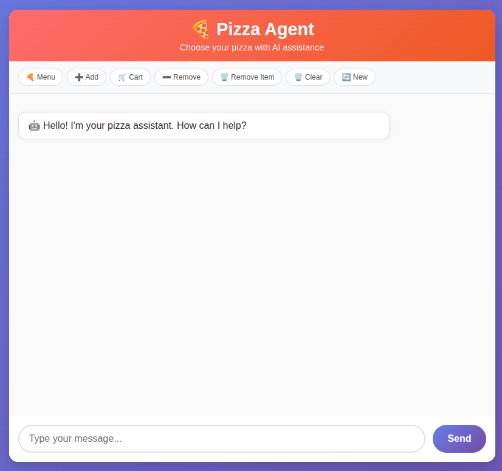
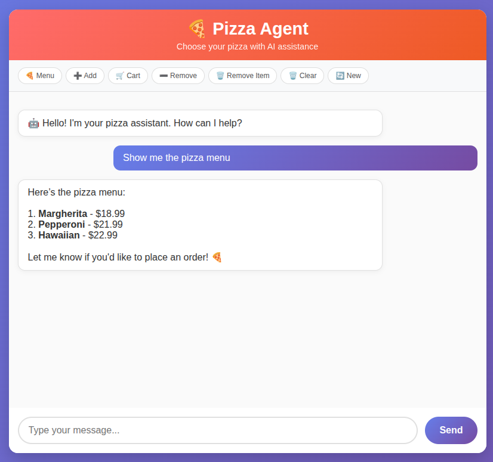
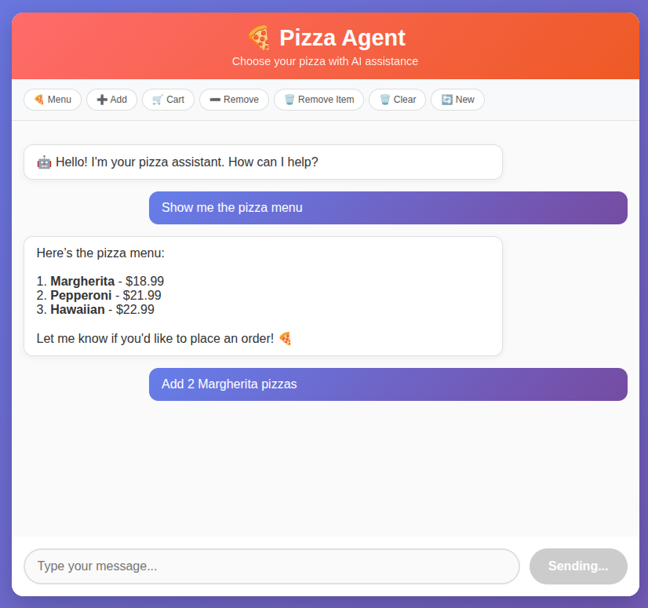
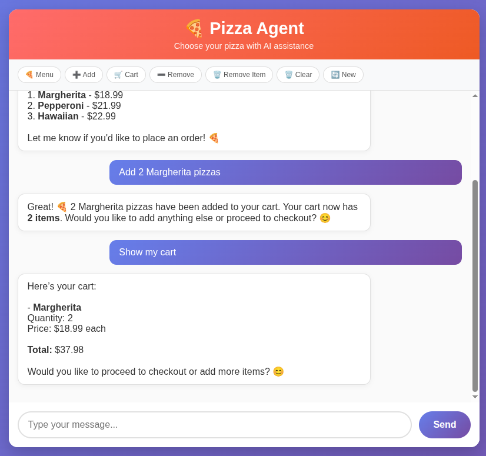

# 🍕 Pizza Ordering Agent with HINOW API

A practical demonstration of how to build an AI agent with **function calling** capabilities using the [HINOW AI Hub](https://hinow.ai). This project implements a complete pizza ordering chatbot with cart management and session handling.

**HINOW** is a comprehensive AI hub that provides fast, standardized, and secure access to the best AI models available. This example showcases the power of HINOW's unified API for building production-ready AI applications.

## 🎬 Agent in Action

See how the AI agent handles natural language requests and automatically selects the right tools:

<div align="center">

### 1. 📋 Requesting the Menu


*The AI understands the menu request and calls the `get_pizza_menu` tool*

---

### 2. 🍕 Placing an Order  


*Natural language order gets converted to `add_to_order` tool call*

---

### 3. ➕ Adding More Items


*The agent seamlessly handles multiple additions with quantity support*

---

### 4. 🛒 Viewing the Cart


*Cart management with `view_cart` tool showing totals and items*

</div>

## 🎯 What This Project Does

- **AI-powered pizza ordering chatbot** with natural language processing
- **Shopping cart management** with user sessions
- **Clean web interface** for seamless user interaction
- **6 powerful tools** that the AI can use: menu viewing, adding/removing items, cart management
- **Quantity support** for bulk orders (e.g., "add 10 margherita pizzas")

## 🏗️ Project Structure

```
📁 pizza_sample/
├── 📄 server.js             # Main backend server with full functionality
├── 📄 pizza_agent.js        # Simplified agent example for learning
├── 📄 index.html            # Frontend web interface
├── 📄 .env                  # Environment configuration (API keys, etc)
├── 📄 package.json          # Node.js dependencies and scripts
└── 📄 README.md             # This documentation
```

## 🚀 Quick Start

1. **Set up environment:**
   ```bash
   cp .env.example .env
   # Edit .env with your HINOW API configuration
   ```

2. **Install dependencies:**
   ```bash
   npm install
   ```

3. **Run the server:**
   ```bash
   npm start
   # or for development with auto-reload:
   npm run dev
   ```

4. **Open your browser:** http://localhost:4455

## 🔧 How It Works

### Backend Architecture (server.js)

**Core Technologies:**
- **Express.js**: RESTful API server
- **Session Management**: Individual user carts with UUID-based sessions
- **Function Calling**: AI-executable tools with structured parameters
- **HINOW API Integration**: Advanced language model with tool capabilities

**Request Flow:**
```
User Input → Frontend → Backend → HINOW API → Tool Execution → Response
                                      ↓
                           [AI analyzes and selects tools]
                                      ↓
                           [Backend executes selected tools]
                                      ↓
                           [AI generates natural response]
```

### Frontend Interface (index.html)

**Technologies:**
- **Responsive HTML5**: Modern semantic structure
- **CSS3**: Beautiful styling with animations and mobile support
- **Vanilla JavaScript**: Clean, dependency-free interaction logic
- **Fetch API**: Asynchronous communication with backend

### Available AI Tools

| Tool | Description | Parameters |
|------|-------------|------------|
| `get_pizza_menu` | Displays available pizzas with prices | None |
| `add_to_order` | Adds pizza(s) to cart | `pizza_id`, `quantity` (optional) |
| `view_cart` | Shows current cart contents and total | None |
| `remove_from_cart` | Removes specific pizzas from cart | `pizza_id`, `quantity` (optional) |
| `update_cart_item` | Updates quantity (0 = remove) | `pizza_id`, `quantity` |
| `clear_cart` | Empties the entire cart | None |

## 🎓 Learning Guide

### For **Programming Beginners:**
1. Start with **index.html** (easier to understand)
2. Learn **HTML structure** and **CSS styling**
3. Study the **frontend JavaScript** logic
4. Finally, explore **server.js** backend code

### For **Intermediate Developers:**
1. Examine **server.js** architecture first
2. Understand **tool definitions** and parameters
3. Study **HINOW API integration** patterns
4. Analyze **session management** implementation

### For **AI/ML Enthusiasts:**
1. Focus on **Function Calling** implementation
2. See how AI **selects appropriate tools**
3. Understand the **two-step API flow**
4. Experiment with **custom tool creation**
5. Explore [HINOW's documentation](https://docs.hinow.ai) for advanced features

## 🧪 Customization Examples

### **Beginner Level:**
1. Modify **pizza menu** items and prices
2. Change **UI colors** and styling
3. Update **button text** and messages

### **Intermediate Level:**
1. Add new **tools** (e.g., apply discount, save favorites)
2. Implement **input validation** and error handling
3. Switch to different **AI models** via configuration

### **Advanced Level:**
1. Replace in-memory storage with **database** (MongoDB, PostgreSQL)
2. Add **user authentication** and persistent accounts
3. Implement **order history** and **recommendation system**

## 🛠️ Technical Features

- **Session-based cart management** with automatic cleanup
- **Robust error handling** for API failures and invalid inputs
- **Quantity support** for bulk operations
- **RESTful API design** with clear endpoints
- **Environment-based configuration** for easy deployment
- **Development-friendly** with nodemon auto-reload

## 📋 API Endpoints

- `POST /chat` - Main chat interface with AI interaction
- Session management handled automatically via cookies

## 🔒 Environment Variables

Create a `.env` file with:
```env
HINOW_API_URL=your_hinow_api_endpoint
HINOW_API_KEY=your_api_key
APP_PORT=4455
AI_MODEL=your_preferred_model
```

## 🆘 Troubleshooting

### **"Cannot find module" Error**
```bash
npm install
```

### **"Port already in use" Error**
Change `APP_PORT` in .env to a different port number

### **API Connection Issues**
- Verify HINOW service is running
- Check API key and endpoint configuration
- Ensure selected model supports function calling

### **Empty AI Responses**
- Verify model compatibility with function calling
- Check API key permissions
- Review HINOW service logs

## 🚀 Deployment

This project is ready for deployment on:
- **Heroku** (add Procfile)
- **Railway** (automatic Node.js detection)
- **Vercel** (with serverless functions)
- **DigitalOcean App Platform**
- **Traditional VPS** with PM2

## 📚 Next Steps

1. **Master the codebase** - understand every component
2. **Build your own agent** - adapt this pattern for different domains
3. **Explore advanced features** - authentication, persistence, analytics
4. **Study [HINOW documentation](https://docs.hinow.ai)** - unlock more AI capabilities
5. **Visit [HINOW AI Hub](https://hinow.ai)** - explore available models and features
6. **Share your creation** - contribute to the community!

## 🤝 Contributing

Feel free to:
- Report bugs and issues
- Suggest new features
- Submit pull requests
- Share your implementations

## 📄 License

MIT License - feel free to use this code for learning and commercial projects.

---

💡 **Note:** This is a **production-ready example** that demonstrates real-world AI agent patterns. Use it as a foundation for your own projects!

## 🌐 HINOW AI Hub Resources

- **🏠 Main Website:** [hinow.ai](https://hinow.ai) - Fast, standardized, and secure access to the best AI models
- **📖 Documentation:** [docs.hinow.ai](https://docs.hinow.ai) - Complete API reference and guides
- **🚀 Get Started:** Sign up for your API key and start building today!

## 🏷️ Keywords

`AI agent` `function calling` `HINOW API` `pizza ordering` `chatbot` `Express.js` `session management` `tool integration` `natural language processing` `AI hub`